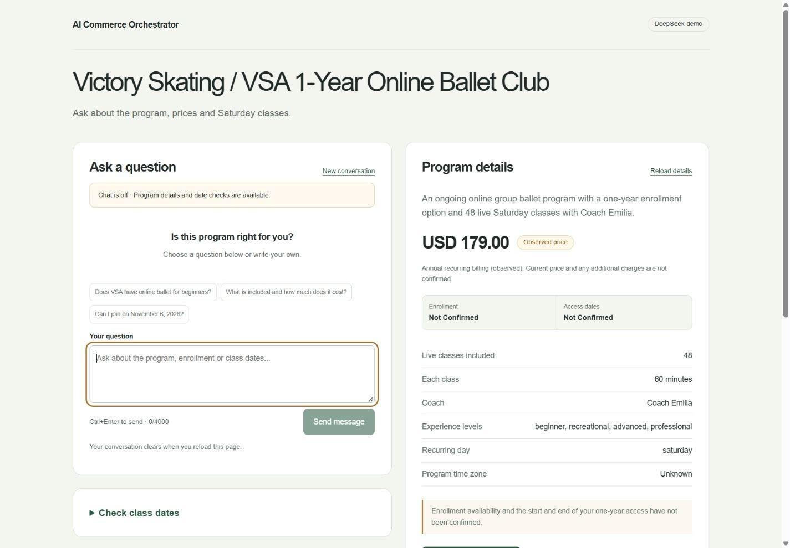
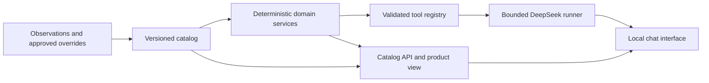

# DeepSeek Commerce Bridge

A local commerce prototype that connects a versioned product catalog to DeepSeek through validated tools. It separates what the assistant can explain from what the application can verify or authorize.

The example is the Victory Skating / VSA annual online ballet club. Product observations are dated October 6, 2026; they are sample evidence, not a current commercial offer. This project is independent of the example business and does not modify ordinary DeepSeek.

## What it does

- Resolves contextual product and business names without mixing annual, private or monthly offers.
- Preserves field-level provenance, observation dates, approval overrides and unknown/conflicting values.
- Exposes seven validated tools for discovery, product details, enrollment, sessions, access and checkout readiness.
- Calculates tentative Saturday dates while keeping enrollment and access entitlement separate.
- Checks source freshness and approved destinations before offering a checkout review link.
- Uses a bounded server-side DeepSeek runner, with independent facts and actions in the UI.



Saved application capture from October 7, 2026, before the project rename. Chat generation was off. It is a historical screenshot, not a live availability check.

## Run locally

Requires Node.js 24.x and npm. Dependency versions are locked.

```sh
npm ci
npm run build
npm run start
```

Open [http://127.0.0.1:3000](http://127.0.0.1:3000). Catalog, calendar and enrollment readiness work without a key. Chat generation is disabled by default. For development, use `npm run dev`.

For an explicitly enabled local DeepSeek session, copy `.env.example` to `.env.local`, enter your own server-side key, then run:

```sh
npm run demo:live
```

Open [http://127.0.0.1:3001](http://127.0.0.1:3001). The demo uses `deepseek-flash`, thinking disabled, with up to 12 messages, 30 provider requests and 60 minutes. Its USD 0.10 estimate guard uses recorded rates; it is not a guaranteed billing cap. Generation stops on errors or missing usage. Review current model availability and pricing before enabling paid generation. Stop with Ctrl+C. See [the adapter guide](docs/DEEPSEEK_ADAPTER.md).

## Architecture



The model handles intent and explanation. Code validates arguments, money formatting, dates, freshness and action permissions. A user saying "I paid" cannot establish payment or access.

## Checks

```sh
npm test
npm run lint
npm run format:check
npm run typecheck
npm run build
npm run check:public
```

Tests use offline fixtures and mocked provider HTTP. CI has no DeepSeek credential and does not run live generation. The public-file check scans tracked files for common credential patterns and excluded private paths; it supplements manual review.

## Sample data and limits

The saved checkout observation showed USD 179 with annual recurring billing. Current price, taxes, enrollment, exact time-zone/DST behavior, breaks and access activation/expiry remain unconfirmed. Approved business overrides are empty. Old observations become stale with the real clock; a blocked checkout review link is expected until evidence is legitimately refreshed.

There is no merchant session creation, payment reconciliation, enrollment/access grant, live availability feed, persistent chat storage or public authentication. The server binds to loopback. Publishing this repository does not publish a hosted application.

Private correspondence, raw evaluation/session records, account balances, credentials and narration recordings are intentionally excluded. The included scope note is explicitly a summary, not the original correspondence or a new approval.

## Documentation

- [Architecture and boundaries](docs/ARCHITECTURE.md)
- [Catalog configuration and endpoints](data/README.md)
- [DeepSeek and bounded local sessions](docs/DEEPSEEK_ADAPTER.md)
- [UI walkthrough](docs/LOCAL_DEMO_GUIDE.md)
- [Evaluation and limitations](docs/EVALUATION.md)
- [Verification record](docs/VERIFICATION.md)
- [Contribution guide](CONTRIBUTING.md)
- [Security policy](SECURITY.md)

## License

The project code is available under the [MIT license](LICENSE). Third-party dependencies retain their own licenses; example business names and source material are not project-owned branding. See [NOTICE.md](NOTICE.md).
